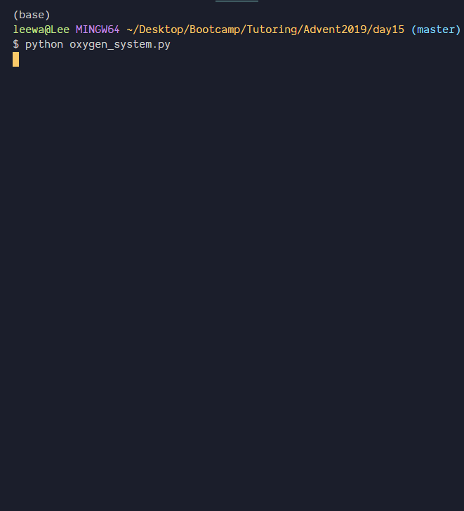

## Solve incredibly hard puzzles using a new language ...what's the worst that could happen?

In December Lee got suckered into doing [Advent of Code](https://adventofcode.com). If you're not familiar, AoC is a collection of puzzles created every year in December. They're meant to be solved one a day leading up until Christmas.

The puzzles are also _notoriously_ difficult, but Lee didn't find that out until after he started.

Not knowing about the difficulty, Lee decided to challenge himself by using AoC as an opportunity to learn Python.

So how did it go?

Well, it went a little like this gif of [day 15](https://youtu.be/dEGizh5CbBc), where you're meant to code a robot exploring a maze in the dark. There was a lot of stumbling and running into deadends, but Lee got there in the end!

---

**Show Notes**:

* 0:56 - Intro
* 1:09 - What is Advent of Code
* 1:53 - How did Lee find Advent of Code
* 2:50 - What were the puzzles like
* 4:00 - Python, JS and making videos
  * Lee's YouTube playlist of all the challenges - [YouTube](https://www.youtube.com/playlist?list=PLObe1ikqQMG7-w_uO8neP4pjut1CktT-W)
* 4:32 - How many videos
* 5:18 - Will this help you at work?
* 8:19 - Lee’s process to get the right answer
* 9:57 - Lee’s favorite day
* 11:30 - Breakout (Brick Breaker) game

  * Lee's solution video - [YouTube](https://youtu.be/6bdxAFHTwfc)
* 15:00 - How would you win Breakout in terminal
* 16:18 - Automating Breakout in the terminal
* 18:29 - Coding a scripting language
  * Lee's solution video - [YouTube](https://youtu.be/0HAdBDDfhm0)
* 22:20 - What does Lee think of Python now
* 23:50 - Would it have been easier with JS
* 26:01 - Globals in Python
* 26:43 - Would you recommend this for someone learning a new language
* 28:45 - How long did the puzzles usually take
* 31:30 - Looking for an answer for a puzzle
* 35:14 - Past years of Advent of Code
* 38:09 - What Lee learned
* 40:19 - Would you do it again next year
* 43:13 - Nerd minute
* 43:40 - Star Wars: Rise of Skywalker
* 45:24 - Last Jedi
* 47:27 - Did Eddie like Rise of Skywalker
* 50:02 - Clone Wars/Rebels
* 51:30 - Cobra Kai
* 56:19 - Crane kick
