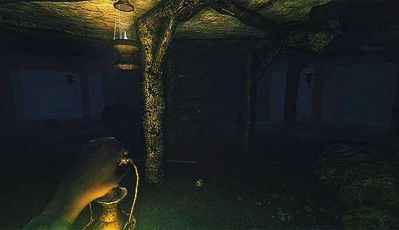

## Have you ever played a video game with a sanity meter?

_(Pictured: Amnesia: The Dark Descent video game footage)_

In these video games, the more things that happen to you, the more of a beating your psyche takes. The worse your mental health reading, the more hallucinations you have.

In Amnesia, the game the above gif is from, you lose sanity when you encounter monsters, and regain it when you make progress in the game.

I used to think this was the most ridiculous video game mechanic ever. How can you put a gauge on something like a person's sanity?

The older I get though, the more I feel like this mechanic is closer to real life than I thought. The more external stressors you have, the less capacity you have to deal with things that come up in life.

## Front-end Developer Rahat Chowdhury knows a thing or two about mental health

Rahat is a boot camp grad like us, and has dealt with impostor syndome, social anxiety and depression.

This week we talk about how to manage your mental health when on the job search and working as a developer, as well as how development teams can help alleviate some of the stress of working in the tech industry.

### Follow Rahat!

Rahat does livestreams of code on his site at [www.rahatcodes.com](https://www.rahatcodes.com).

You can also find him on twitter [@RahatCodes](https://twitter.com/RahatCodes), and check out [his podcast](https://twitter.com/tech4humansio) there too.

## Resources for mental health

If you're struggling with mental health, please seek help!

* **For immediate help, call 911 (in the US)**
* **National Suicide Prevention Hotline**: 1-800-273-8255 or [live online chat](http://www.suicidepreventionlifeline.org/GetHelp/LifelineChat.aspx)
* To locate treatment in your area, call the SAMHSA **Treatment referral helpline**: 1-877-726-4727
* For more info, check out [MentalHealth.gov](https://www.mentalhealth.gov/)
---

**Show Notes:**

* 0:45 - Welcome
* 1:11 - Rahat intro
* 3:34 - Job search
* 6:40 - JS Fundamentals
* 9:25 - Mental health in tech
* 12:13 - How can a lead dev help the team
* 13:56 - Mentorship
* 15:22 - Conference talks
* 18:54 - Going outside your comfort zone
* 21:18 - Rap name
  * Rahat's latest single - [site](https://distrokid.com/hyperfollow/rahat/fS2K)
* 21:40 - Imposter syndrome
* 29:25 - Burnout
* 32:55 - Tips to avoid burnout
* 37:53 - When to get help
* 39:22 - How to find help
* 46:00 - Tips for dealing with burnout and depression
* 47:54 - Nerd minute
* 48:27 - Demon slayer
* 50:23 - Disney afternoon collection
* 54:11 - El Camino: A Breaking Bad Movie
* 57:47 - Outro/Thanks
