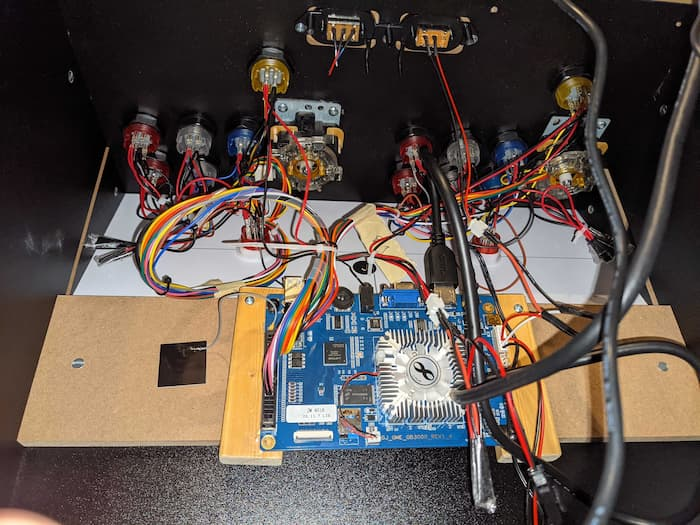

## _"You guys are just the ones that made it!"_

A couple of times we've heard the argument that we're too soft on boot camps because we're just the ones that made it to the other side.

But is it true? Or are these naysayers just looking for any chance to bag on code boot camps?

In this episode we recap our own experiences with friends, students and classmates post-boot camp, as well as dig into some data from third party groups that report on job placement for graduates.

...And then in nerd minute Eddie talks about modding arcade cabinets for like a half hour.

---

**Show Notes:**

* 1:01 - What is survivorship bias
* 4:27 - Eddie's experience with boot camp graduates
* 6:05 - Lee's experience with graduates
  * Personal responsibility
  * getting remote work as a junior during COVID
* 10:30 - Is Orlando a tech hub?
* 13:10 - Boot camp job placement rates
  * [Career Karma Placement Rates](https://careerkarma.com/blog/coding-bootcamp-job-placement/) ([Full Report](https://careerkarma.com/blog/bootcamp-market-report-2020/))
  * [Course Report ...report](https://www.coursereport.com/reports/coding-bootcamp-job-placement-report-2019)
* 21:50 - How to be the cream of the crop
* 24:30 - Is our success reproducible in Orlando?
  * A lot of graduates find out that coding isn't for them
* 28:45 - OK Eddie, shoot your shot about Arcade cabs in Nerd Minute
  * It's just a half hour of Eddie talking about his Arcade mods. You asked for this, so here it is, fans.
  * [RivalBoss Video](https://www.youtube.com/watch?v=lfHvDfvYKPU&t=0s)
  * [X-men! Welcome... to Die!](https://youtu.be/IdAmkx8eAos)

